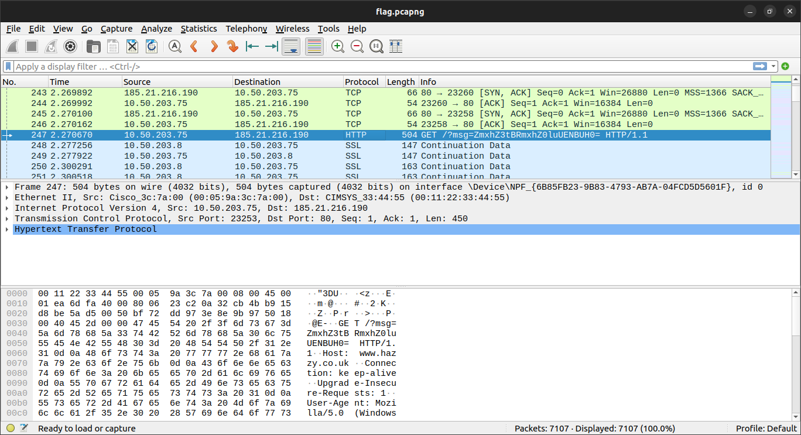

# A CAPture of a Flag

* Open the file using `wireshark` and take a look to the captured packet~!@#$%^&*()__+}|{"?><M
* Packet N: 247, you'll notice a __GET__ request with a _msg_ variable



* by decoding the message from __base64__, you'll get the flag:

```bash

echo ZmxhZ3tBRmxhZ0luUENBUH0= | base64 -d

```

* Flag: 

```
flag{AFlagInPCAP}
```
