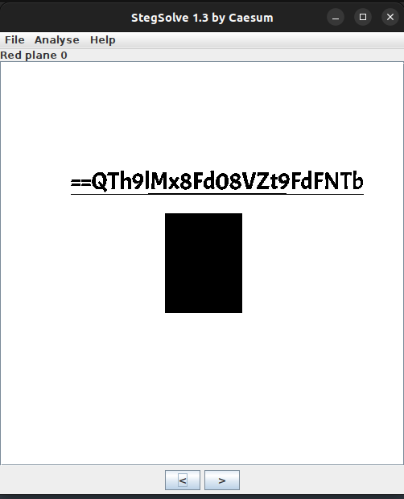
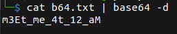

# Ambush Mission

## Description

* Hi, i can't tell you my name since now i'm in a mission. In case to arrest our fugitive target, our team had been intercepted communication between the target with his fellow and found this image.
* It looks like they are going to meet in specific place, but we still don't know the time yet. Can you help me?
* [Attachement](https://mega.nz/#!TKZ3DabY!BEUHD7VJvq_b-M22eD4VfHv_PPBnW2m7CZUfMbveZYw)

## Solution

* Using `stegsolve.jar` and try different modes, we get a `base64` encoded text.



* writing it down, and decoding from `base64` we get our flag.



* Flag:

```
m3Et_me_4t_12_aM
```