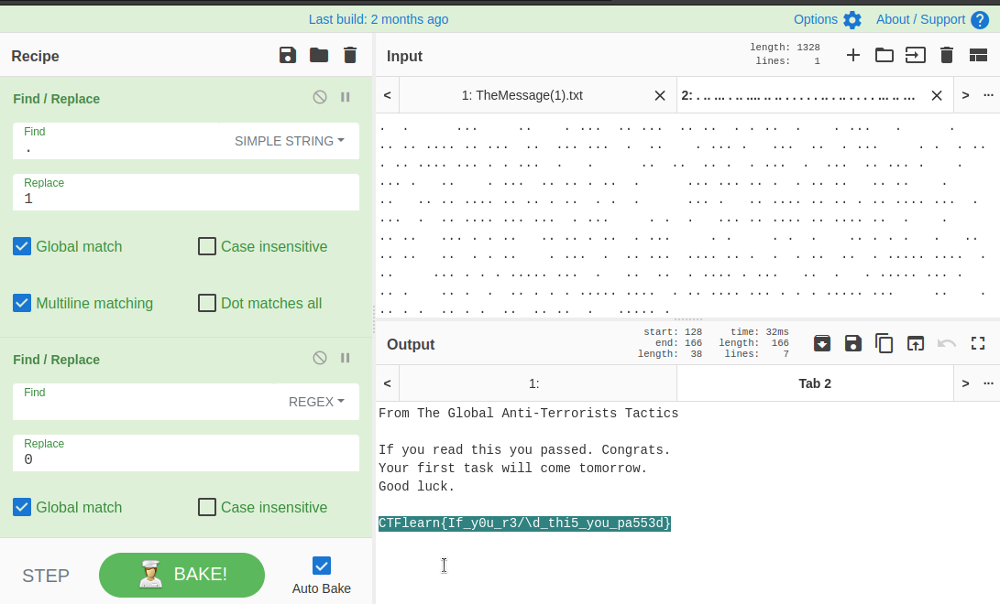

# Blank Page

## Description

* I've just graduated the Super Agent School. This is my first day as a spy. The Master-Mind sent me the secret message, but I don't remember how to read this. Help!
* [Attachement](https://ctflearn.com/challenge/download/959)

## Solution

1. Using `CyberChef` to read the content of the file, we found that all what we get is a space and a dot(.)
2. Using `find/replace`, replace ' ' with '0' and '.' with '1'
3. Decode the output from binary to get the flag



* Flag:

```
CTFlearn{If_y0u_r3/\d_thi5_you_pa553d}
```