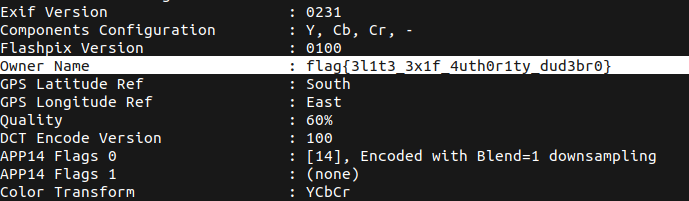

# Exif

## Description

* If only the password were in the image?
* You could really ‘own’ it with exif.

* [Attachement](https://mega.nz/#!SDpF0aYC!fkkhBJuBBtBKGsLTDiF2NuLihP2WRd97Iynd3PhWqRw)

## Solution

1. Running `exiftool` to check the meta data of the image, we can immediately see the flag, now we can simply copy it  



2. Or we can use a simple pipe to __grep__ to extract only the flag

```bash
exiftool Computer-Password-Security-Hacker\ -\ Copy.jpg | grep -ioE "flag{.*?}"
```

* Flag

```
flag{3l1t3_3x1f_4uth0r1ty_dud3br0}
```