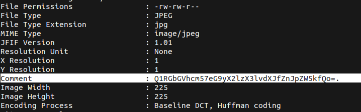
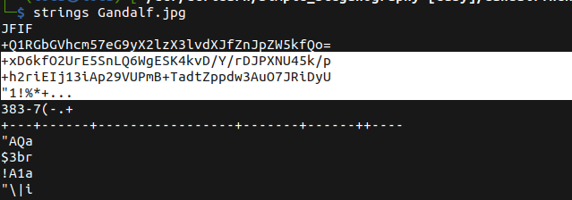

# GandalfTheWise

## Description

* Extract the flag from the Gandalf.jpg file. You may need to write a quick script to solve this.
* [Attachement](https://ctflearn.com/challenge/download/936)

## Solution

1. Runnig `exiftool`, we find a `base64` encoded text, decoding it we get what it seems like a flag but sadly it's not



2. Runnig `strings`, we find 2 other `base64` encoded text



3. Decoding them doesn't help us, after some researches, we get the idea of `xor`ing the them
4. Using a `python` script to do the job

* Flag:

```
CTFlearn{Gandalf.BilboBaggins}
```