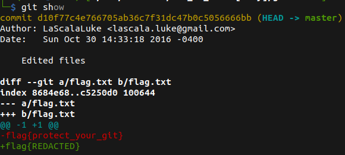

# Git is Good

## Description

* The flag used to be there. But then I redacted it. Good Luck.
* [Attachement](https://mega.nz/#!3CwDFZpJ!Jjr55hfJQJ5-jspnyrnVtqBkMHGJrd6Nn_QqM7iXEuc)

## Solution

1. Unzipping the file, we see a flag.txt inside the folder, but sadly the flag has been changed
2. Running `ls -la`, we notice that there is a `.git` folder
3. Running `git show`, to see the changes that have been happened to the file we found our flag



* Flag:

```
flag{protect_your_git}
```