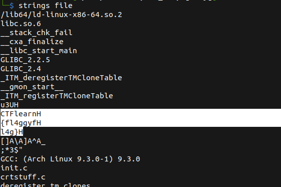

# I'm Dump

## Description

* The keyword is hexadecimal, and removing an useless H.E.H.U.H.E. from the flag.
* [Attachement](https://ctflearn.com/challenge/download/883)

> Note: The flag is in the format CTFlearn{}


## Solution

1. Running `strings` on the file, and look to the result we can see the flag



2. Now let's remove the useless 'H' that we've in the flag

* Flag:

```
CTFlearn{fl4ggyfl4g}
```