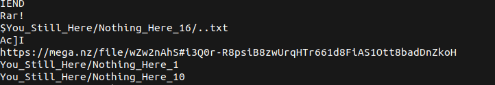
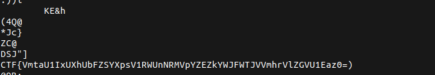
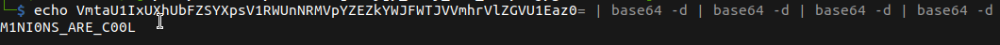

# Minions

## Description

* Hey! Minions have stolen my flag, encoded it few times in one cipher, and then hidden it somewhere there: 
* Can you help me? TIP: Decode the flag until you got a sentence.
* [Attachement](https://mega.nz/file/1UBViYgD#kjKISs9pUB4E-1d79166FeX3TiY5VQcHJ_GrcMbaLhg)

## Solution

1. Using `Strings`, we found a link to another file



2. Using `binwalk` to extract what is inside the second image, we get a _.rar_ file
3. Extracting the _rar_ file, we get another image
4. Using `Strings` on the last image _(image 3)_, we notice a base64 encoded text



5. Using `base64` to decode the text multiple times, we get the flag



* Flag:

```
CTFlearn{M1NI0NS_ARE_C00L}
```