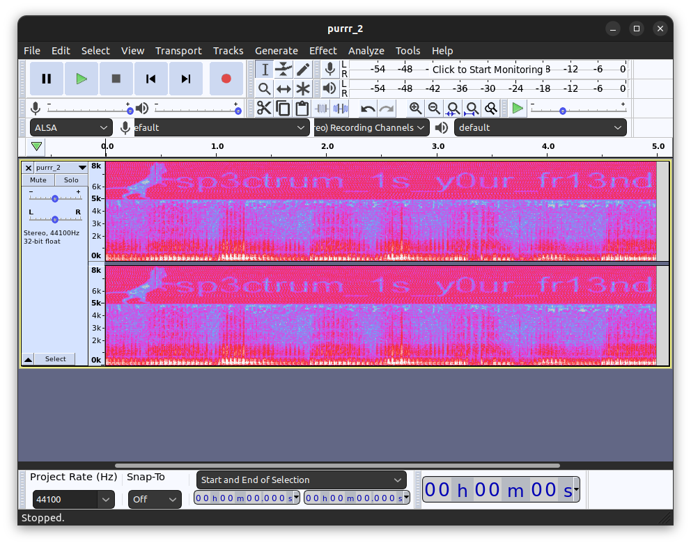
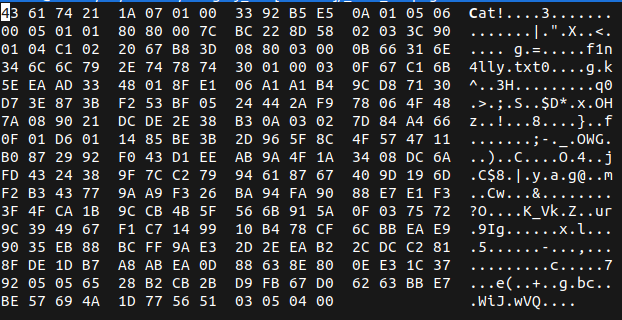
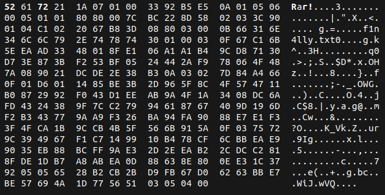
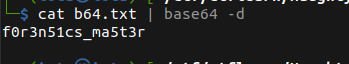

# Naughty Cat

## Description

* I think my cat is hiding something...
* [Attachement](https://ctflearn.com/challenge/download/890)

## Solution

1. Using `binwalk` to extract what is hidden in the image

```bash
binwalk --dd=".*" cut3_c4t.png
```

2. One of the extracted files is a `rar` file, by extracting it we get an `audio` and another _corrupted_ `rar` file
3. Using `Audacity` to read the __Spectogram__ of the audio we get a text that seems like a password that we'll later



4. Trying to extract the other `rar` file we get an error, it's because the file header is corrupted
5. Using `hexedit` to edit the magic bytes/header of the file so that it becomes a valid rar file

* Original:



* Modified:



6. Reading the content of the extracted text file, we get a `base64` encrypted text


7. Using `base64` to decode the encrypted text we get our flag



* Flag:

```
CTFLearn{f0r3n51cs_ma5t3r}
```
