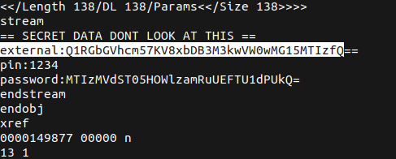
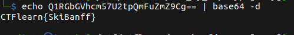

# PDF by fdpumyp


## Description

* Hi, just as we talked during a break, you have this file here and check if something is wrong with it. That's the only thing we found strange with this suspect, I hope there will be a password for his external drive

* [Attachement](https://ctflearn.com/challenge/download/957)

* Bye

## Solution

1. Using `strings` , we notice a `base64` encoded text in the external



2. Using `base64` to decrypt the text, we get a the flag



* Flag:

```
CTFlearn{SkiBanff}
```