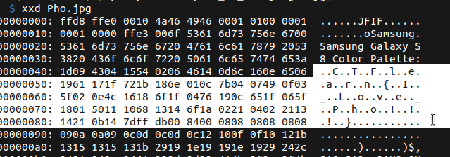

# Pho is Tasty!

## Description

* The flag is hidden in the jpeg file. Good Luck! Have some Pho! Solve this challenge before solving my Scope challenge for 100 points.
* [Attachement](https://ctflearn.com/challenge/download/971)

## Solution

1. Using `xxd` or `hexedit`, we find our flag 

> Don't forget to remove the '..' between each letter



* Flag:

```
CTFlearn{I_Love_Pho!!!}
```