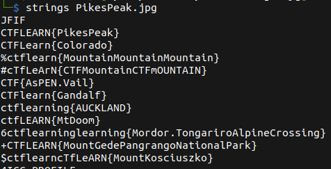

# PikesPeak

## Description

* Pay attention to those strings!
* [Attachement](https://ctflearn.com/challenge/download/935)

## Solution

1. Using `Strings` we get a lot of flags, but only one them is the correct one



2. Using `grep` to filter out the output of the `strings` command

```bash
strings PikesPeak.jpg |grep -ioE "ctflearn{.*?}"                             

# CTFLEARN{PikesPeak}
# CTFLearn{Colorado}
# ctflearn{MountainMountainMountain}
# cTfLeArN{CTFMountainCTFmOUNTAIN}
# CTFlearn{Gandalf}
# ctfLEARN{MtDoom}
# CTFLEARN{MountGedePangrangoNationalPark}
# cTfLeARN{MountKosciuszko}
```

3. The answer is the flag with the right format: `CTFlearn{}`

* Flag

```
CTFlearn{Gandalf}
```