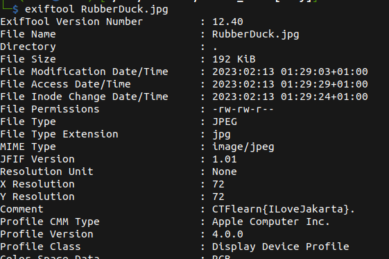

# Rubber Duck

## Description

* Find the flag! Simple forensics challenge to get started with.
* [Attachement](https://ctflearn.com/challenge/download/933)

## Solution

1. Running `exiftool` to check the meta data of the image, we can immediately see the flag, now we can simply copy it  



2. Or we can use a simple pipe to __grep__ to extract only the flag

```bash
exiftool RubberDuck.jpg | grep -ioE "CTFLearn{.*?}"
```

* Flag:

```
CTFlearn{ILoveJakarta}
```