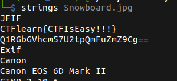

# Snowboard

## Description

* Find the flag in the jpeg file. Good Luck!
* [Attachement](https://ctflearn.com/challenge/download/934)

## Solution

1. Using `Strings` we get a flag, but sadly not the real one



2. Just after the fake flag, we've a __base64__ encoded text
3. Using `base64` command line to decode it, we get the correct flag

```bash
echo Q1RGbGVhcm57U2tpQmFuZmZ9Cg== | base64 -d
```

* Flag

```
CTFlearn{SkiBanff}
```