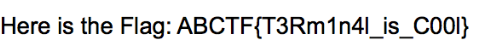

# Taking LS

## Description

* Just take the Ls. Check out this zip file and I be the flag will remain hidden. 
* [attachement](https://mega.nz/#!mCgBjZgB!_FtmAm8s_mpsHr7KWv8GYUzhbThNn0I8cHMBi4fJQp8)

## Solution

1. Unzip the file, we get a folder named "The Flag", inside of it we've a protected pdf file and another folder named ".ThePassword"
2. Using the password we get from "ThePassword.txt" to unlock the pdf file, and Voila! we get the flag
3. you can either write the flag your self, or you can take a screenshot of it and use and OCR tool to get the text inside the image

> Note: The last letter of the flag is 'l' not 'I'.

* using `tesseract` to extract the flag from the image `flag.png`



```bash
# Syntaxt 
# tesseract <input file> <output file>
tesseract flag.png flag

```

* Flag:

```
ABCTF{T3Rm1n4l_is_COOl}
```
