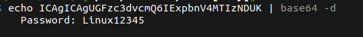
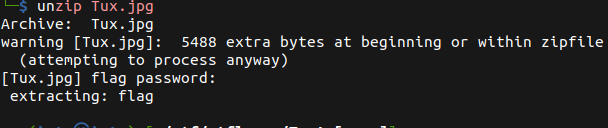

# Tux!

## Description

* The flag is hidden inside the Penguin! Solve this challenge before solving my 100 point Scope challenge which uses similar techniques as this one.
* [Attachement](https://ctflearn.com/challenge/download/973)

## Solution

1. Using `exiftool` to view image metadata, we notice a `base64` encoded text


2. Using `base64` to decrypt the text, we get a password



3. Using the password to unzip the image, and we get the flag



* Flag:

```
CTFlearn{Linux_Is_Awesome}
```