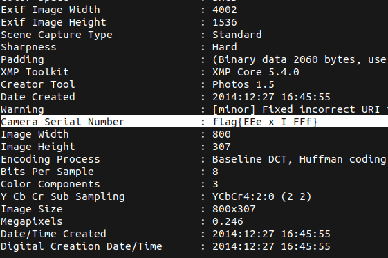

# WOW ... So Meta

## Description

* This photo was taken by our target. See what you can find out about him from it. 
* [Attachement](https://mega.nz/#!ifA2QAwQ!WF-S-MtWHugj8lx1QanGG7V91R-S1ng7dDRSV25iFbk)

## Solution

1. Running `exiftool` to check the meta data of the image, we can immediately see the flag, now we can simply copy it  



2. Or we can use a simple pipe to __grep__ to extract only the flag

```bash
exiftool 3UWLBAUCb9Z2.jpg | grep -ioE "flag{.*?}"
```

* Flag

```
flag{EEe_x_I_FFf}
```