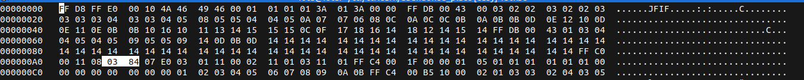
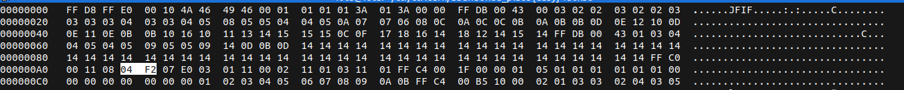

# Abandoned Place

## Description

* the flag is outside of the pic, try to find it. 
* [Attachement](https://ctflearn.com/challenge/download/1000)

> another hint: dimensions, dimensions, everything is in dimensions.


## Solution

1. Opening the image, we see that it's a big image
2. Using the hint, we notice that the challenge has something to do with dimensions
3. Using `hexedit` to play around with _width/height_ value from the image

* Old values:


* New values:


> Learn more about hiding information by changing image height from this blog article [link](https://blog.cyberhacktics.com/hiding-information-by-changing-an-images-height/)

* Flag:

```
CTFlearn{urban_exploration}
```